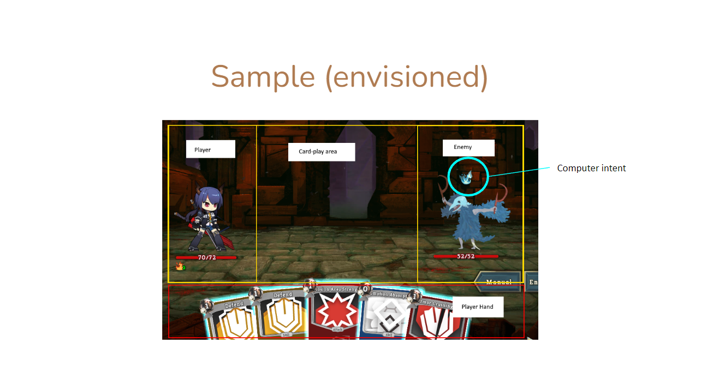

# <a href="https://septismjustinn.github.io/PokeErrPoker/" target="_blank">PokeErrPoker</a>

## Concept

"Slay the Spire"-inspired poker card combat HTML game, in which a player faces off against an RNG-driven computer opponent.

### Gameplay

Each turn, the player plays poker hands, either to attack the computer or to defend against its own attacks. However, the computer will also roll its own set of moves to diminish the player's attacks or overcome their defences.

Player chooses from a randomly drawn set of 10 cards. Cards are numbered from 2 to 9 or are picture cards (A, J, Q, K)

## Technologies used

### HTML

HTML was used to set up the page. All elements used are present and hidden via the script's switching of the elements class and consequently the class-associated css styling.

To display the character elements, the page layout was setup such that the player character was visible on the left side of the page and the computer character on the right side, these elements flanking a space in the center of the page dedicated to displaying cards that would be played and information about what was occurring during a turn. The bottom half of the screen was primarily occupied by the player's hand and game controls, such as buttons to start/restart the game or to accept/reset moves.

### CSS

A CSS was used to shape and position the HTML elements. Class-specific styling was heavily utilized to provide graphics for suits or to hide inactive elements.

### JavaScript

A script was written in JavaScript to provide game logic, randomizing the cards to compromise the player's hand and randomizing the computer's moves. This was done through extensive use of JavaScript's built-in Math.random function and transformation of the generated number.

To capture player's input (Mouse clicks, mouse drags and keyboard presses), event listeners had to be utilized to watch out for inputs and react accordingly, ensuring that containers in the script tallied with elements on the player's screen and proceeding with the game when appropriate elements were interacted with.

## Approach

I started off with the page layout in HTML, creating grids and bordered div elements to create the game space as I had [envisioned](#sources-of-inspiration), lightly touching up the stylesheet to give the barebones page a stomachable aesthetic to look at during early development.

I then moved on to the script, where the bulk of my time was spent weaving the [game concept](#concept) into code, the game logic bound by classes and run by functions. I implemented each portion of the game sequentially; Each time a new function or feature was introduced, I stress tested my code to check if anything had broken or if it had interacted with an undesired part of my program.

Only once the game was mostly functional did I then start focusing on styling my HTML elements since at that point, I had added almost all of the elements I would have needed for the game.

## Sources of inspiration

<a href="https://store.steampowered.com/app/646570/Slay_the_Spire/" target="_blank">Slay the Spire by Mega Crit Games</a>

Initial concept, captured in Slay the Spire.

<a href="https://en.wikipedia.org/wiki/List_of_poker_hands" target="_blank">Poker</a>

## Challenges

- Due to the interactability of the many HTML elements in the page, one big challenge was to identify as many cases of elements interacting with each other as possible and from these cases, weed out unsavoury interactions. Cards being dragged into buttons, text being dragged into the cards and deleting the grid, buttons being clicked when they were not supposed to were few of several bugs that occurred during development. Everytime a new feature was added, the game had to go through intensive stress testing to see if a user could break the game in as many ways as could be thought of.

- Another challenge was to make the game comfortable visible across screens of different sizes. As different monitors were used to view the page throughout development, the game would be cut off at inconvenient portions of the page. This led to development having to be conducted while alternating between devices of different screen resolutions to ensure that the game and page was properly visible on each device.
